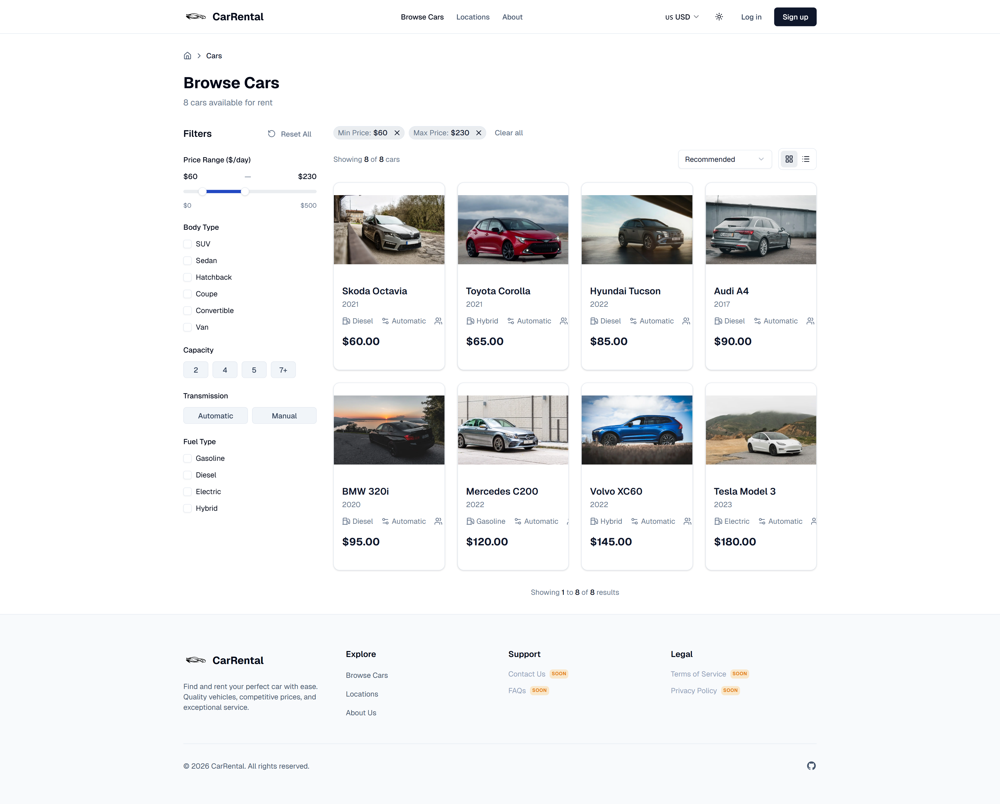
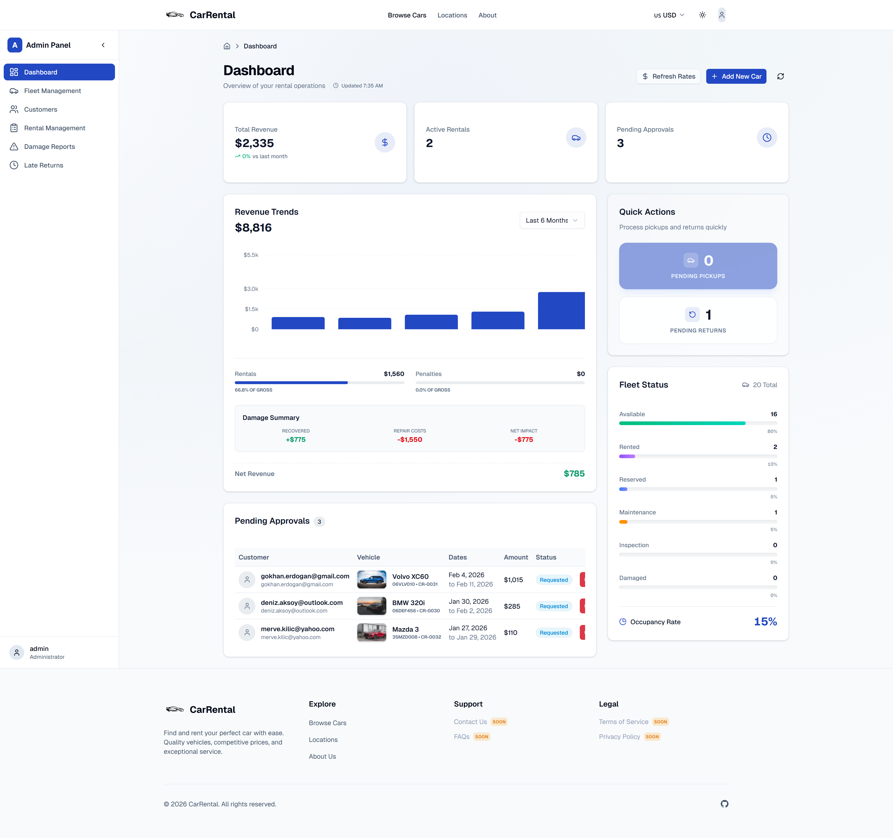
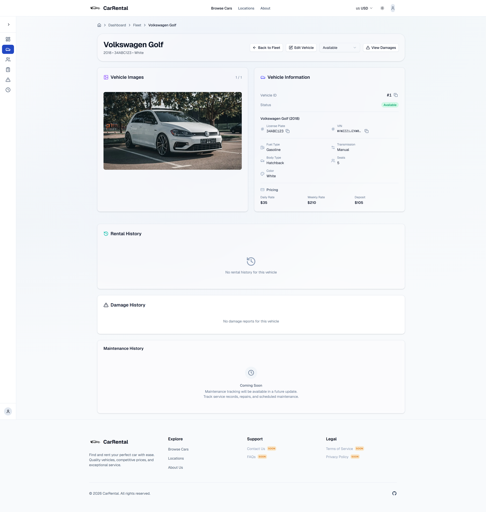
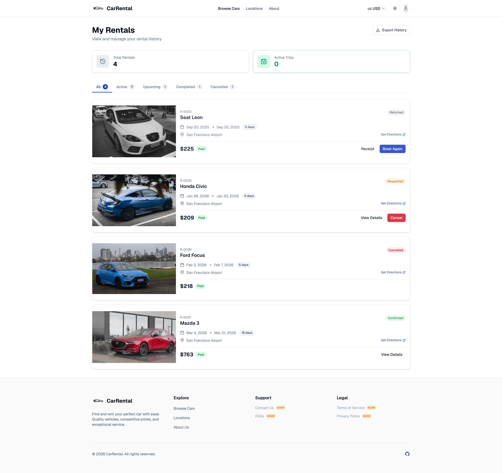
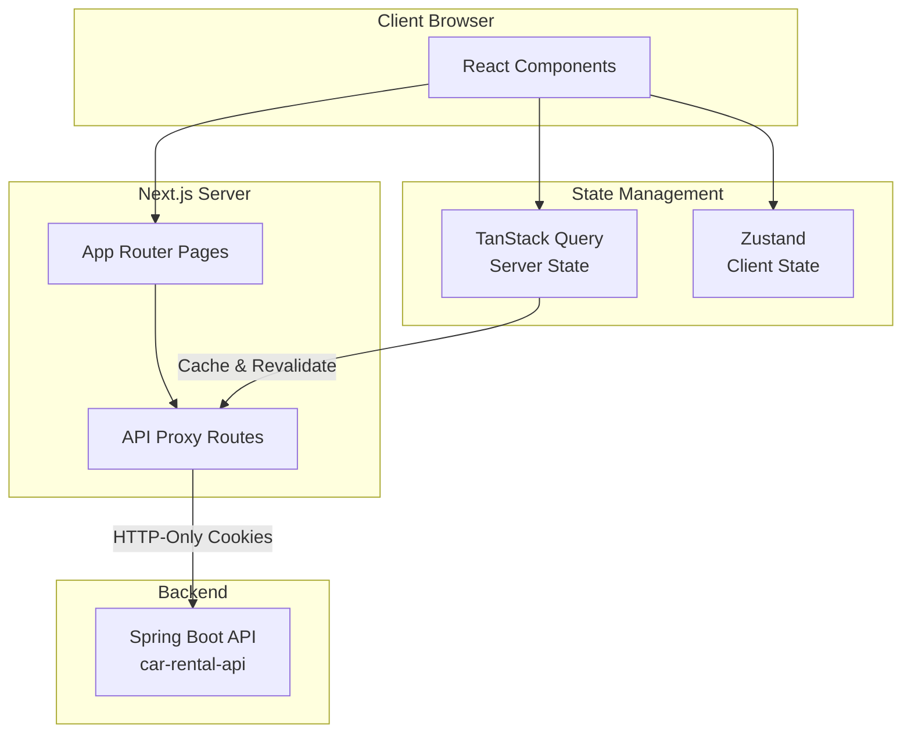

# 🚗 Car Rental Web

A production-ready frontend for car rental management, built with **Next.js 16.1** and **TypeScript**.

[](https://nextjs.org/)
[](https://www.typescriptlang.org/)
[](https://tailwindcss.com/)
[](/)
[](LICENSE)

> **🚀 Live Demo:** [arabakiralama.site](https://arabakiralama.site)

---

## 📸 Screenshots

<details open>
<summary><b>🏠 Landing Page</b></summary>


*Hero section with featured cars and search functionality*

</details>

<details>
<summary><b>🚗 Car Catalog</b></summary>


*Advanced filtering with brand, transmission, fuel type, and availability dates*

</details>

<details>
<summary><b>📊 Admin Dashboard</b></summary>


*Real-time metrics, alerts, and quick actions for fleet management*

</details>

<details>
<summary><b>🔍 Car Detail</b></summary>


*Interactive availability calendar and comprehensive vehicle specifications*

</details>

<details>
<summary><b>👤 User Dashboard</b></summary>


*Rental history and status tracking*

</details>

<details>
<summary><b>🛡️ Admin Fleet Management</b></summary>


*Fleet status overview and vehicle management*

</details>

<details>
<summary><b>🌙 Dark Mode Support</b></summary>


*Admin Fleet Management with dark theme - Seamless theme switching*

</details>

---


## ✨ Features

| Feature | Description |
|---------|-------------|
| **Smart Search** | Filter cars by brand, transmission, fuel type, availability dates |
| **Interactive Details** | Real-time availability calendar, comprehensive specs, dynamic pricing |
| **Booking Flow** | Request → Confirm → Pickup → Return workflow with status tracking |
| **User Dashboard** | Manage rentals, view history, update profile, payment methods |
| **Admin Dashboard** | Fleet management, rental approvals, revenue analytics, quick actions |
| **Authentication** | JWT + OAuth2 (Google, GitHub), HTTP-Only cookies, secure sessions |
| **Payment Integration** | Stripe checkout, payment history, refund management |
| **Damage Reporting** | Photo upload, assessment workflow, dispute resolution |
| **Currency Conversion** | Real-time exchange rates, multi-currency support |
| **Responsive Design** | Mobile-first, dark/light mode, accessibility compliant |

## 🏗️ Architecture

This frontend uses **Next.js App Router** with API Proxy pattern for secure backend communication.

<details>
<summary>� <b>View Application Structure</b></summary>



</details>

### Route Groups

| Route Group | Purpose | Authentication |
|-------------|---------|----------------|
| `(public)` | Landing, car browsing, search | Public |
| `(auth)` | Login, register, OAuth2 callback | Public |
| `(protected)` | User dashboard, my rentals, settings | Required (USER) |
| `(admin)` | Fleet management, approvals, analytics | Required (ADMIN) |

### API Proxy Pattern

```
Client → Next.js API Route → Backend API
         ↓ (attaches cookie)
         ↓ (handles CORS)
         ↓ (error transformation)
```

**Benefits:**
- ✅ HTTP-Only cookies (XSS protection)
- ✅ No CORS issues
- ✅ Centralized error handling
- ✅ Request/response transformation

### Architecture Roadmap

**v1.0.0 (Current) - Monolithic Structure**
- ✅ Next.js App Router with route groups
- ✅ API Proxy pattern
- ✅ Zustand + TanStack Query
- ❌ No architectural boundaries
- ❌ No automated verification
- ❌ Tight coupling between features

**v2.0.0 (Planned) - Feature-Sliced Design**
- 🔄 6-layer architecture (app, pages, widgets, features, entities, shared)
- 🔄 Automated boundary enforcement (ESLint + Vitest)
- 🔄 Event-driven feature communication
- 🔄 80%+ test coverage
- 🔄 Backend-level discipline


| Category | Technology |
|----------|------------|
| Framework | Next.js 16.1 (App Router) |
| Language | TypeScript 5.x |
| Styling | Tailwind CSS v4, shadcn/ui |
| State Management | Zustand (client), TanStack Query (server) |
| Forms | react-hook-form, Zod validation |
| Testing | Vitest, React Testing Library, fast-check |
| Auth | JWT, OAuth2 (Google, GitHub) |
| Payment | Stripe Elements (Planned) |
| Icons | lucide-react |
| Date | date-fns |

## 🚀 Quick Start

### Prerequisites
- Node.js 18+ (LTS recommended)
- Running [Car Rental API](https://github.com/TheOdrig/car-rental-api) backend

### Setup

```bash
# Clone
git clone https://github.com/TheOdrig/car-rental-web.git
cd car-rental-web

# Install dependencies
npm install

# Configure environment
cp .env.example .env
# Edit .env with your backend URL

# Run development server
npm run dev
```

### Access
- **Frontend:** `http://localhost:3000`
- **Backend API:** `http://localhost:8082` (must be running)

## 📱 Pages Overview

### Public Pages
```
/                    # Landing page with featured cars
/cars                # Car catalog with filters
/cars/[id]           # Car details with availability calendar
/about               # About page
/locations           # Rental locations
```

### Authentication
```
/login               # Email/password login
/register            # User registration
/oauth2/callback     # OAuth2 redirect handler
```

### User Dashboard (Protected)
```
/dashboard           # My rentals overview
/dashboard/rentals   # Rental history
/dashboard/settings  # Profile settings
```

### Admin Dashboard (Admin Only)
```
/admin               # Admin overview with metrics
/admin/fleet         # Fleet management
/admin/fleet/[id]    # Vehicle details
/admin/rentals       # Rental approvals
/admin/rentals/[id]  # Rental details
/admin/users         # User management
/admin/users/[id]    # User details
```

## 🧪 Testing

```bash
# Run all tests
npm test

# Watch mode
npm run test:watch

# Coverage report
npm run test:coverage
```

**Test Strategy:**
- Unit tests for components and hooks
- Integration tests for critical flows

**Current Status:** Tests passing, coverage below target (v1.0.0 baseline)

## 📂 Project Structure

```
src/
├── app/                 # Next.js App Router
│   ├── (public)/        # Public pages
│   ├── (auth)/          # Auth pages
│   ├── (protected)/     # User dashboard
│   ├── (admin)/         # Admin dashboard
│   └── api/             # API Proxy Routes
├── components/          # React Components
│   ├── ui/              # shadcn/ui primitives
│   ├── cars/            # Car components
│   ├── rentals/         # Rental components
│   ├── admin/           # Admin components
│   └── shared/          # Shared components
├── lib/                 # Business Logic
│   ├── api/             # API client (server/client)
│   ├── hooks/           # Custom hooks
│   ├── stores/          # Zustand stores
│   ├── utils/           # Utilities
│   └── validations/     # Zod schemas
├── types/               # TypeScript types
└── tests/               # Test files
```

## 🔧 Configuration

See `.env.example` for required environment variables:

```env
# Backend API URL (Browser Access)
NEXT_PUBLIC_API_URL=http://localhost:8082

# Internal API URL (Server-side Access / Docker Network)
API_URL=http://localhost:8082

# JWT Secret - Must match the backend JWT signing key
JWT_SECRET=your-jwt-secret-key-here
```

**Environment Variables:**
- `NEXT_PUBLIC_API_URL` - Backend API URL (accessible from browser)
- `API_URL` - Internal API URL (server-side only, for Docker/production)
- `JWT_SECRET` - JWT signing key (must match backend configuration)


## 🤝 Contributing

Contributions are welcome! Please read the contributing guidelines before submitting a pull request.

Quick steps:
1. Fork the repository
2. Create feature branch (`git checkout -b feature/amazing-feature`)
3. Run tests (`npm test`)
4. Commit using [Conventional Commits](https://www.conventionalcommits.org/)
5. Push and open Pull Request

## 📋 Changelog

See [CHANGELOG.md](CHANGELOG.md) for version history and notable changes.

## 📝 Documentation

- **[CHANGELOG.md](CHANGELOG.md)** - Version history and release notes

## 📄 License

This project is licensed under the MIT License. See the [LICENSE](LICENSE) file for details.

## 👤 Author

**Mehmet Akif Uludag**

[](https://github.com/TheOdrig)

---

**Backend Repository:** [car-rental-api](https://github.com/TheOdrig/car-rental-api)
